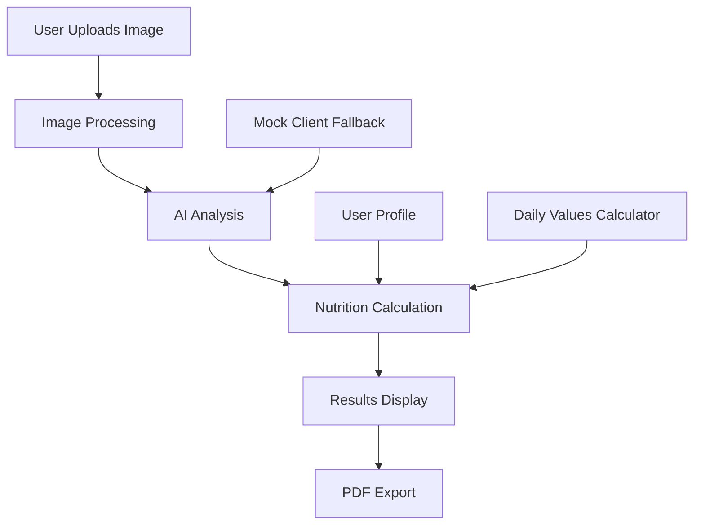
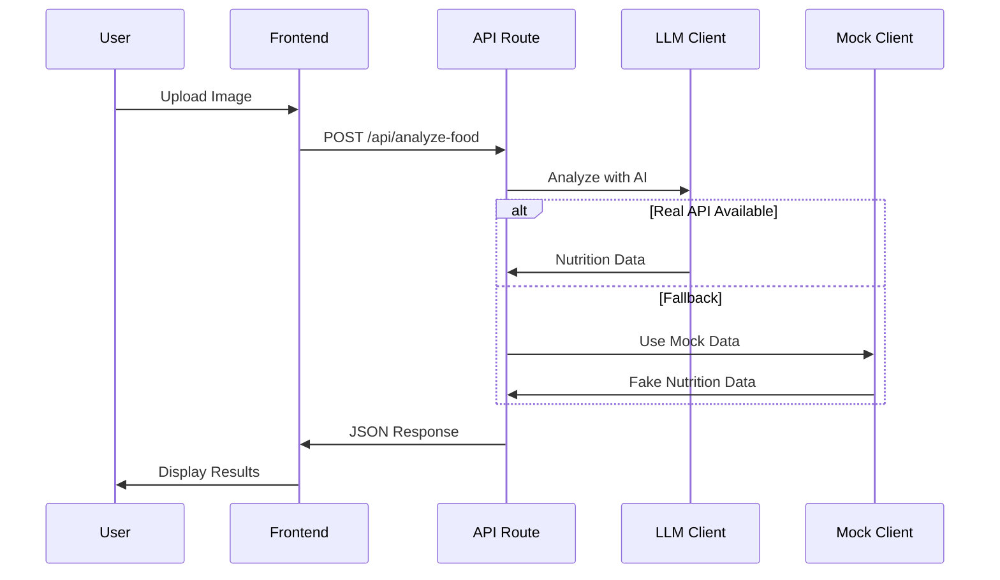

# 🍽️ Caldish Project Overview

## 🎯 What is Caldish?

Caldish is an AI-powered web application that analyzes food photos and provides detailed nutritional information. Users upload images of their meals and receive instant breakdowns of calories, macronutrients, vitamins, and minerals.

## ⚡ Key Features

- **📸 Photo Upload**: Drag & drop or click to upload food images
- **🤖 AI Analysis**: Computer vision identifies foods and estimates nutrition
- **📊 Detailed Results**: Comprehensive nutrition breakdown with daily percentages
- **👤 Personalization**: User profiles for customized recommendations
- **📄 PDF Export**: Professional nutrition reports for sharing
- **📱 Responsive**: Works on desktop and mobile devices

## 🛠️ Technology Stack

| Component | Technology | Purpose |
|-----------|------------|---------|
| **Frontend** | Next.js 14 + React | Modern web framework |
| **Styling** | Tailwind CSS | Utility-first CSS |
| **Language** | TypeScript | Type safety |
| **AI/LLM** | OpenAI GPT-4V | Food image analysis |
| **PDF** | jsPDF | Client-side PDF generation |
| **State** | React Hooks | Local state management |
| **Storage** | localStorage | User preferences |

## 🏗️ Architecture



## 📁 Project Structure

```
caldish/
├── 📱 app/                 # Next.js App Router
│   ├── 🔌 api/            # Backend API endpoints
│   ├── 🎨 globals.css     # Global styles
│   ├── 📄 page.tsx        # Main application
│   └── 🖼️ layout.tsx      # Root layout
├── 🧩 components/         # React Components
│   ├── 🎛️ ui/             # Reusable UI elements
│   ├── 📤 ImageUpload.tsx # File upload component
│   ├── 📊 NutritionResults.tsx # Results display
│   └── 👤 UserProfileModal.tsx # User settings
├── 📚 lib/                # Business Logic
│   ├── 🤖 llm/            # LLM integrations
│   ├── 📐 types/          # TypeScript definitions
│   ├── 🛠️ utils/          # Helper functions
│   └── ⚙️ constants.ts    # App configuration
├── 🪝 hooks/              # Custom React Hooks
├── 🌐 public/             # Static Assets
└── 📖 docs/               # Documentation
```

## 🔄 User Flow

1. **Landing Page**: User sees upload interface
2. **Image Upload**: Drag/drop or select food photo
3. **Processing**: Image sent to AI for analysis
4. **Results**: Detailed nutrition breakdown displayed
5. **Personalization**: Optional user profile for custom recommendations
6. **Export**: Generate PDF report for sharing

## 🎨 Design System

### Color Palette
- **Primary**: Green (#22c55e) - Health & freshness
- **Secondary**: Blue (#3b82f6) - Trust & reliability
- **Accent**: Amber (#f59e0b) - Attention & warnings
- **Neutral**: Gray scale for text & backgrounds

### Typography
- **Headings**: Bold, clear hierarchy
- **Body**: Readable, accessible fonts
- **Data**: Monospace for numbers

### Components
- **Cards**: Rounded corners, subtle shadows
- **Buttons**: Clear call-to-actions
- **Forms**: Clean, intuitive inputs
- **Charts**: Visual nutrition data

## 🔌 API Integration

### OpenAI GPT-4V
- **Primary**: Real food analysis
- **Cost**: ~$0.01-0.02 per image
- **Accuracy**: High with detailed descriptions

### DeepSeek (Future)
- **Status**: Vision models not yet available
- **Purpose**: Cost-effective alternative
- **Implementation**: Ready for when supported

### Mock Client
- **Purpose**: Demo without API keys
- **Features**: Realistic fake data
- **Benefits**: Testing & development

## 📊 Data Flow



## 🧪 Testing Strategy

### Manual Testing
- Upload various food types
- Test without API keys (mock mode)
- Verify PDF export
- Check mobile responsiveness
- Test user profile features

### Edge Cases
- Large images (>10MB)
- Unsupported formats (HEIF)
- Network timeouts
- Invalid API keys
- Empty responses

## 🚀 Deployment Options

### Vercel (Recommended)
- **Pros**: Zero config, automatic deployments
- **Setup**: Connect GitHub repo
- **Environment**: Add API keys to dashboard

### Netlify
- **Pros**: Good for static sites
- **Setup**: Build command: `npm run build`
- **Output**: `out/` directory

### Self-hosted
- **Requirements**: Node.js 18+
- **Setup**: `npm run build && npm start`
- **Port**: Default 3000

## 📈 Future Roadmap

### Phase 1 (Current)
- ✅ Basic food analysis
- ✅ PDF export
- ✅ User profiles
- ✅ Responsive design

### Phase 2 (Planned)
- 🔄 User authentication
- 🔄 Analysis history
- 🔄 Batch processing
- 🔄 Recipe suggestions

### Phase 3 (Future)
- 📱 Mobile app
- 🗄️ Database integration
- 👥 Social features
- 🔬 Advanced analytics

## 🎯 Success Metrics

- **User Engagement**: Upload success rate
- **Analysis Quality**: User feedback on accuracy
- **Performance**: Response time < 5 seconds
- **Accessibility**: WCAG compliance
- **Mobile Usage**: Responsive design adoption

## 🔐 Security Considerations

- **API Keys**: Environment variables only
- **File Upload**: Size & type validation
- **Data Privacy**: No image storage
- **Error Handling**: No sensitive data in logs

## 📞 Support & Maintenance

- **Bug Reports**: GitHub Issues
- **Feature Requests**: GitHub Discussions
- **Documentation**: Keep README updated
- **Dependencies**: Regular security updates

---

**Ready to contribute? Check out [SETUP.md](./SETUP.md) and [CONTRIBUTING.md](./CONTRIBUTING.md)!** 🚀
